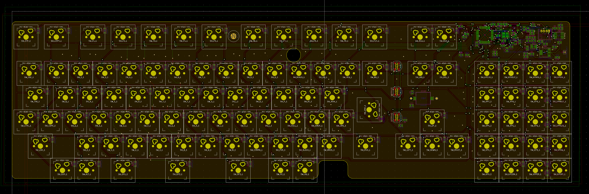

# nec-pc-8801-type-a

USB/QMK atmega32u4 pcb for NEC PC 8801 (NEC vintage linear and possibly equivalent SMK) with added MX and Alps support.  Also with WS2812B addressable LED & buzzer support.  

Released without warranty, use at your own risk.  Check your layout carefully too.

PRs & feedback welcome!

---

Dimensions: 405mm x 135.5mm

---

Shield: [![CC BY-SA 4.0][cc-by-sa-shield]][cc-by-sa]

This work is licensed under a
[Creative Commons Attribution-ShareAlike 4.0 International License][cc-by-sa].

[![CC BY-SA 4.0][cc-by-sa-image]][cc-by-sa]

[cc-by-sa]: http://creativecommons.org/licenses/by-sa/4.0/
[cc-by-sa-image]: https://licensebuttons.net/l/by-sa/4.0/88x31.png
[cc-by-sa-shield]: https://img.shields.io/badge/License-CC%20BY--SA%204.0-lightgrey.svg
